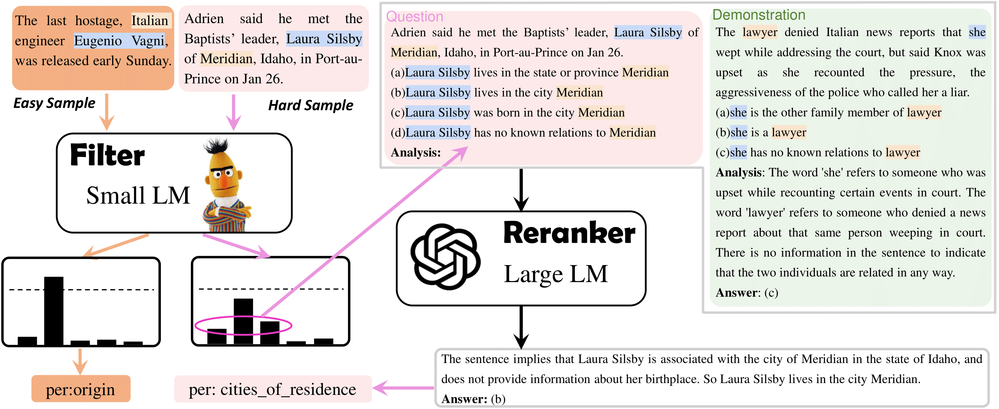

# Large Language Model Is Not a Good Few-shot Information Extractor, but a Good Reranker for Hard Samples!
This is the implementation of **filter-then-rerank** pipeline in [Large Language Model Is Not a Good Few-shot Information Extractor, but a Good Reranker for Hard Samples!](https://arxiv.org/abs/2303.08559). EMNLP'2023 (Findings). 

If you have any question about this work, feel free to contact yubo001@e.ntu.edu.sg


## Overview

We develop **filter-then-rerank** paradigm to solve IE tasks effectively and efficiently. Combining the merits of both Small Language Models (SLMs) and Large Language Models (LLMs), this paradigm includes two main components:
* Filter: A small LM. It initially predicts and determines the difficulty of each sample. In our work, the difficulty is determined by the maximum predicted probability $s$ among all candidate labels. For **easy samples** ($s > \tau$, where $\tau$ is a threshold), we retain the predicted results from LLMs. For **hard samples** ($s < \tau$), we provide the short-list candidate (top-K likely labels) to reranker for final decision.
* Reranker: A large LM. We convert each difficult sample with their candidate answers to a multi-choice question. Given several demonstrations, we ask the reranker to analyze and answer this question.


## Prerequisite
**Environment**
* python 3.8.13
* Pytorch 1.10.1
* openai 0.27.0
* Transformers 4.24.0
* backoff

**OpenAI API key**

We use GPT-4 as the reranker. Please set up your openAI API key by:
```
export OPENAI_API_KEY=[your api key]
```

**Results from the filter (SLM)**

Unfortunately, we only provide the SLM's preliminary predictions of FewNERD dataset. We are not granted to release SLM's predictions on TACREV and ACE05 because they are non-public datasets. For reproduce the results of these two datasets, we suggest you:

1. Run SLM-based methods (for example, vanilla fine-tuning) on these datasets.

2. Save the results in `./SLM_results`. For TACREV (relation extraction task) and ACE05 (event detection task), please save the predictions as the format shown in `./SLM_results/examples_re_tacrev` and `./SLM_results/examples_ed_ace`, respectively.


## Quick start
**FewNERD**
```
bash ./scripts/run_ner_fewnerd.sh
```

**TACREV**
```
# To run this command, you shall firstly generate and save corresponding SLM's predictions.
# Then complete the env variables SLM_RES_PATH and OUT_PATH in the script.
bash ./scripts/run_re_tacrev.sh
```

**ACE05**
```
# To run this command, you shall firstly generate and save corresponding SLM's predictions.
# Then complete the env variables SLM_RES_PATH and OUT_PATH in the script.
bash ./scripts/run_ed_ace.sh
```

## Citation
Please cite our paper if it is helpful for your work:
```bibtex
@misc{ma2023large,
      title={Large Language Model Is Not a Good Few-shot Information Extractor, but a Good Reranker for Hard Samples!}, 
      author={Yubo Ma and Yixin Cao and YongChing Hong and Aixin Sun},
      year={2023},
      eprint={2303.08559},
      archivePrefix={arXiv},
      primaryClass={cs.CL}
}
```
